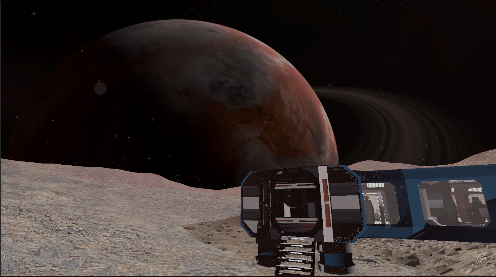
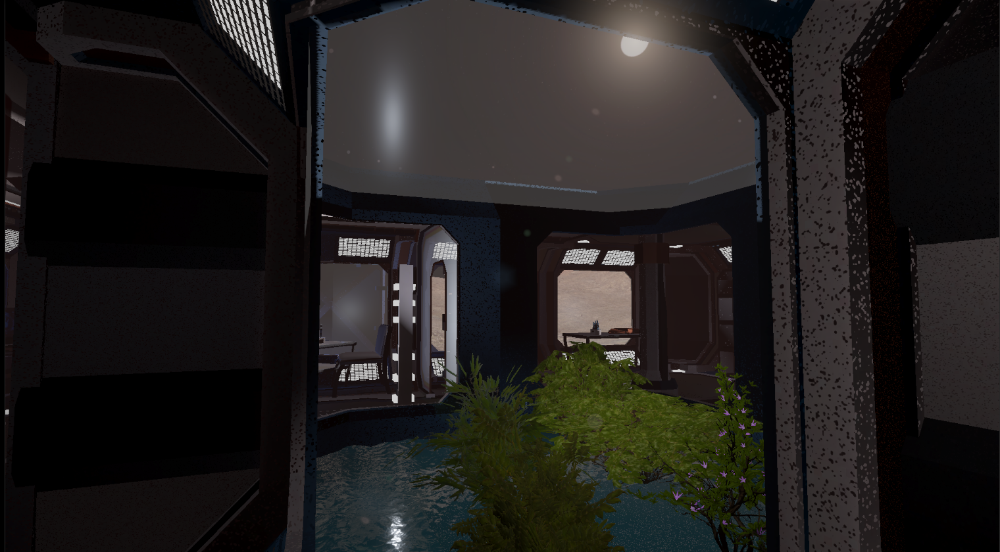
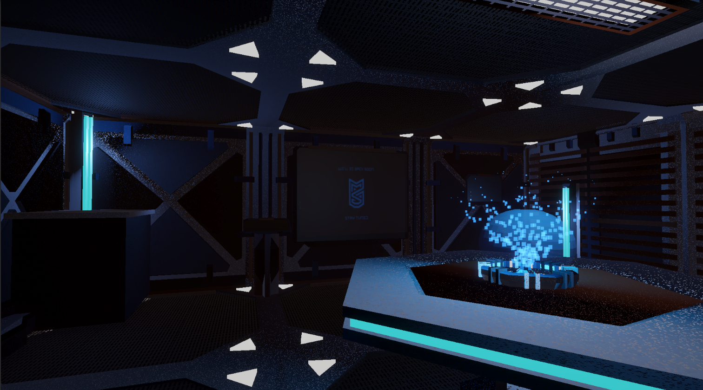

# Exploración Espacial - Luna de Exoplaneta Exótico

## Descripción del proyecto

Este proyecto consiste en la creación de una escena 3D interactiva desarrollada en Unity 6, que representa la superficie de una luna perteneciente a un exoplaneta gigante gaseoso. La ambientación busca transmitir la sensación de exploración espacial en un entorno de baja gravedad, incorporando elementos tecnológicos, naturales e interactivos para enriquecer la experiencia del usuario.

---

## ¿Qué problema o propósito aborda el ejercicio?

El objetivo de este ejercicio fue desarrollar una escena 3D completa que integrara los principales conceptos vistos durante el curso, incluyendo:

* Jerarquía de objetos.
* Cámara interactiva.
* Transformaciones y posicionamiento de elementos.
* Materiales PBR (Physically Based Rendering).
* Sistemas de iluminación.
* Animaciones.
* Interacción del usuario.
* Sonido ambiental y efectos de audio.

La escena busca demostrar la capacidad de construir un entorno inmersivo e interactivo utilizando herramientas modernas de desarrollo 3D.

---

## Tema seleccionado

Se escogió el tema de **espacio exterior y base lunar**, ambientando la experiencia en una luna exótica orbitando un gigantesco planeta gaseoso.

---

## Descripción de la escena

La escena representa una base de exploración científica ubicada sobre la superficie de una luna extraterrestre.

Entre los elementos principales se encuentran:

* Una base tecnológica con computadores futuristas.
* Un jardín experimental adaptado al entorno espacial.
* Un área industrial con generadores animados que rotan constantemente.
* Una torre de comunicaciones que transmite señales hacia el espacio profundo.
* Sistemas de sonido ambiental que aportan inmersión a la experiencia.

El usuario puede desplazarse libremente por el escenario mediante controles en primera persona:

* **W, A, S, D:** Movimiento.
* **Espacio:** Salto.

Además, las puertas de la base se abren y cierran automáticamente cuando el jugador se aproxima, permitiendo una interacción natural con el entorno.

---

## Capturas de pantalla

### Vista general de la base

### Jardín experimental bajo la luz estelar

### Sala de hologramas

---

## Video demostrativo

Puede visualizarse una vista previa de la escena en YouTube:

**Enlace:** https://youtu.be/L4uhHPQKvGo

---

## Descarga del proyecto

El proyecto completo de Unity puede descargarse desde Google Drive:

**Enlace:** https://drive.google.com/drive/folders/1eGIryzzIMVFw9c-E2Se5KX3NokwVYLNH?usp=sharing

---

## Herramientas, librerías y motores utilizados

* Unity 6
* Lenguaje de programación C#
* Assets obtenidos desde la librería de recursos de Unity
* Sistema de audio integrado de Unity
* Materiales PBR
* Sistema de iluminación y animación de Unity

---

## ¿Cómo se ejecuta la solución?

La aplicación puede ejecutarse directamente desde el navegador mediante una compilación WebGL alojada en línea.

**Enlace WebGL:** https://play.unity.com/en/games/1c2c34d8-3054-40f5-9300-23e93bfbc610/builds

### Controles

| Acción          | Tecla   |
| --------------- | ------- |
| Avanzar         | W       |
| Retroceder      | S       |
| Mover izquierda | A       |
| Mover derecha   | D       |
| Saltar          | Espacio |
| Mirar alrededor | Mouse   |

---

## Resultados obtenidos

Se logró construir una escena 3D funcional que incluye:

* Navegación en primera persona.
* Interacción con elementos del entorno.
* Puertas automáticas interactivas.
* Animaciones de objetos mecánicos.
* Iluminación espacial.
* Materiales PBR.
* Efectos de sonido ambiental.
* Organización jerárquica de objetos dentro de Unity.

La escena proporciona una experiencia inmersiva que combina exploración, ambientación futurista e interacción con el entorno.

---

## Nota importante

> En la versión compilada para WebGL, Unity eliminó algunas animaciones presentes en las pantallas dinámicas de la escena durante el proceso de construcción (build). Como consecuencia, dichas animaciones pueden no visualizarse correctamente en la versión web, aunque funcionan adecuadamente dentro del editor de Unity.

---

## Dificultades encontradas y soluciones implementadas

### Limitaciones de hardware

El principal desafío durante el desarrollo fue el uso de un computador portátil antiguo con recursos limitados, lo que provocaba bajos niveles de rendimiento durante la edición y prueba de la escena.

**Solución implementada:**

* Optimización de la cantidad de objetos visibles.
* Uso moderado de efectos visuales.
* Pruebas constantes para mantener una tasa de rendimiento aceptable.
* Ajustes de calidad durante el desarrollo para facilitar la edición.

---

## ¿Qué prompts de IA se utilizaron?

No se utilizaron herramientas de inteligencia artificial durante el desarrollo del proyecto.

Todo el diseño, implementación, programación, configuración de materiales, iluminación, animaciones e interacciones fue realizado manualmente.

---

## ¿Qué partes fueron verificadas manualmente por el estudiante?

Se verificó manualmente:

* Navegación del jugador.
* Funcionamiento de los controles WASD.
* Mecánica de salto.
* Apertura y cierre de puertas.
* Animaciones de los generadores.
* Correcta visualización de materiales y texturas.
* Configuración de iluminación.
* Sonidos ambientales.
* Organización jerárquica de la escena.
* Funcionamiento de la compilación WebGL.

Todas las pruebas fueron realizadas directamente por el estudiante antes de la entrega final.
